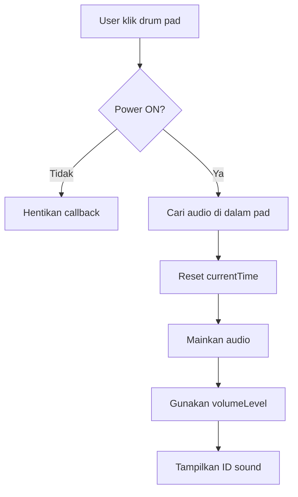
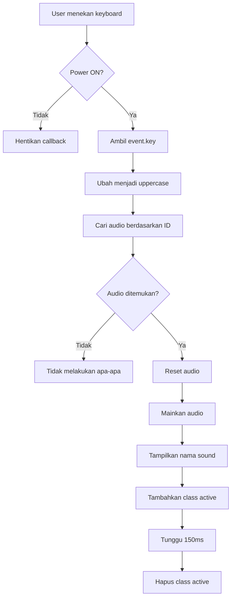
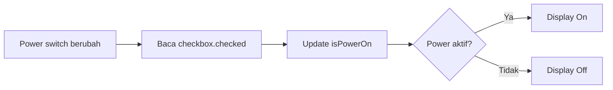
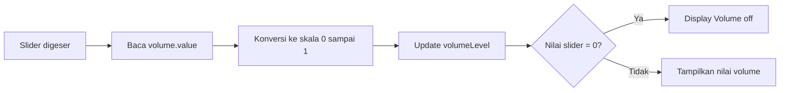
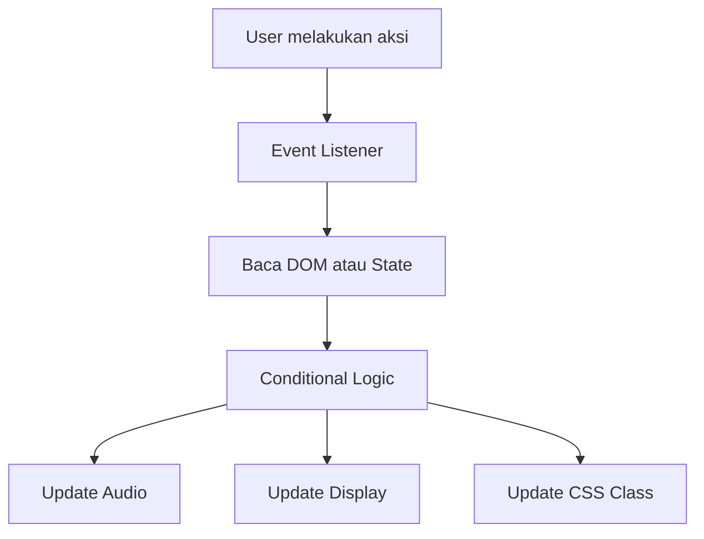
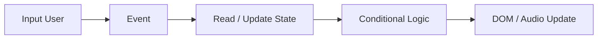

# Build a Drum Machine

<p align="center">
  
</p>

<p align="center">
  Drum machine interaktif berbasis <strong>HTML, CSS, dan JavaScript</strong> yang dapat dimainkan dengan mouse maupun keyboard.
</p>

<p align="center">
  <strong>HTML5</strong> ·
  <strong>CSS3</strong> ·
  <strong>JavaScript</strong> ·
  <strong>DOM Events</strong> ·
  <strong>HTML Audio</strong>
</p>

---

## Tentang Project

Project ini merupakan latihan **freeCodeCamp Build a Drum Machine**.

Tujuan utamanya adalah membuat sembilan drum pad yang dapat memainkan suara berbeda melalui klik mouse atau tombol keyboard.

Selain memenuhi fungsi dasar drum machine, project ini juga dikembangkan dengan:

- **Power switch** untuk mengaktifkan atau mematikan drum.
- **Volume slider** untuk mengatur keras suara.
- **Display panel** untuk menampilkan sound, status power, dan volume.
- **Keyboard visual feedback** agar pad terlihat aktif ketika dimainkan dari keyboard.

Project ini membantu saya memahami hubungan antara **DOM, event listener, state, audio, dan perubahan UI** di JavaScript.

---

## Fitur

- Memainkan 9 suara drum yang berbeda.
- Mendukung input dari mouse.
- Mendukung input keyboard `Q W E A S D Z X C`.
- Memulai ulang audio dari awal ketika pad ditekan berulang kali.
- Menampilkan nama sound pada display.
- Memberikan efek visual saat keyboard digunakan.
- Menyediakan Power switch ON/OFF.
- Menyediakan kontrol volume `0-100`.
- Menampilkan status `Volume off` saat volume berada di `0`.

---

## Drum Pad Mapping

| Key | Sound | Pad ID |
|:---:|---|---|
| `Q` | Heater 1 | `heater-1` |
| `W` | Heater 2 | `heater-2` |
| `E` | Heater 3 | `heater-3` |
| `A` | Heater 4 | `heater-4` |
| `S` | Clap | `clap` |
| `D` | Open Hi-Hat | `open-hh` |
| `Z` | Kick n' Hat | `kick-n-hat` |
| `X` | Kick | `kick` |
| `C` | Closed Hi-Hat | `closed-hh` |

---

## Struktur Project

```text
drum-machine/
├── index.html
├── styles.css
├── script.js
└── assets/
    └── drum-machine.png
```

---

## Struktur HTML

Container utama project:

```html
<div id="drum-machine">
```

Di dalamnya terdapat beberapa bagian:

```text
#drum-machine
├── #pad-bank
├── #display
├── .power
└── .volume-control
```

Setiap drum pad menggunakan `<button>` dan memiliki satu elemen `<audio>` di dalamnya.

```html
<button class="drum-pad" id="heater-1" type="button">
  Q
  <audio
    class="clip"
    id="Q"
    src="https://cdn.freecodecamp.org/curriculum/drum/Heater-1.mp3">
  </audio>
</button>
```

Struktur ini membuat satu pad memiliki tiga informasi penting:

| Bagian | Fungsi |
|---|---|
| `.drum-pad` | Tombol yang dapat diklik |
| `id="heater-1"` | Nama sound yang ditampilkan |
| `<audio id="Q">` | Audio yang terhubung dengan tombol keyboard `Q` |

---

## JavaScript

### DOM Selection

Elemen yang dibutuhkan diambil dari DOM terlebih dahulu.

```js
const drumPadElements = document.querySelectorAll(".drum-pad");
const displayElement = document.getElementById("display");
const powerButton = document.getElementById("power");
const volumeElement = document.getElementById("volume");
```

`querySelectorAll()` digunakan untuk mengambil seluruh drum pad.

`getElementById()` digunakan untuk mengambil satu elemen berdasarkan ID.

---

## State

Project ini memiliki dua state utama:

```js
let isPowerOn = powerButton.checked;
let volumeLevel = volumeElement.value / 100;
```

### `isPowerOn`

Menyimpan kondisi Power.

```text
true  = drum aktif
false = drum tidak aktif
```

### `volumeLevel`

Menyimpan volume dalam rentang:

```text
0 sampai 1
```

Slider HTML menggunakan rentang:

```text
0 sampai 100
```

Karena itu nilainya dikonversi:

```js
volumeElement.value / 100
```

Contoh:

| Slider | `volumeLevel` |
|---:|---:|
| `0` | `0` |
| `25` | `0.25` |
| `50` | `0.5` |
| `75` | `0.75` |
| `100` | `1` |

---

## Memainkan Drum dengan Mouse

Setiap drum pad diberi event `click`.

```js
drumPadElements.forEach((drumPad) => {
  drumPad.addEventListener("click", () => {
    ...
  });
});
```

Sebelum audio dimainkan, Power diperiksa:

```js
if (!isPowerOn) return;
```

Jika Power OFF, callback langsung dihentikan.

Audio milik pad yang diklik kemudian dicari dengan:

```js
const audio = drumPad.querySelector(".clip");
```

Audio di-reset ke awal:

```js
audio.currentTime = 0;
```

Lalu dimainkan:

```js
audio.play();
```

Nama sound ditampilkan dengan:

```js
displayElement.textContent = drumPad.id;
```

---

## Memainkan Drum dengan Keyboard

Keyboard dideteksi menggunakan event:

```js
document.addEventListener("keydown", (event) => {
  ...
});
```

Tombol yang ditekan dibaca melalui:

```js
event.key
```

Kemudian diubah menjadi huruf kapital:

```js
const key = event.key.toUpperCase();
```

Ini membuat:

```text
q
```

dan:

```text
Q
```

diproses sebagai key yang sama.

Audio dicari berdasarkan ID:

```js
const keyElement = document.getElementById(key);
```

Jika user menekan `Q`, JavaScript mencari:

```html
<audio id="Q">
```

Pengecekan berikut mencegah error ketika user menekan tombol lain:

```js
if (keyElement) {
  ...
}
```

---

## Mengakses Parent Element

Pada keyboard handler, `keyElement` menunjuk ke elemen `<audio>`.

Nama sound berada pada parent-nya, yaitu `<button>`.

Karena itu digunakan:

```js
keyElement.parentElement.id
```

Nilai tersebut kemudian ditampilkan ke display:

```js
displayElement.textContent = keyElement.parentElement.id;
```

---

## Keyboard Visual Feedback

Keyboard tidak otomatis memicu CSS `:active`.

Karena itu class `active` ditambahkan melalui JavaScript:

```js
keyElement.parentElement.classList.add("active");
```

Kemudian dihapus setelah `150ms`:

```js
setTimeout(() => {
  keyElement.parentElement.classList.remove("active");
}, 150);
```

CSS untuk state tersebut:

```css
.drum-pad.active {
  background: #f59e0b;
  transform: scale(0.95);
}
```

---

## Power Control

Power menggunakan checkbox:

```html
<input type="checkbox" id="power" checked>
```

Atribut `checked` membuat Power aktif saat halaman pertama dibuka.

Perubahan switch dideteksi melalui:

```js
powerButton.addEventListener("change", () => {
  ...
});
```

State kemudian diperbarui:

```js
isPowerOn = powerButton.checked;
```

Display menggunakan ternary operator:

```js
displayElement.textContent = isPowerOn ? "On" : "Off";
```

Bentuk dasar ternary operator:

```js
condition ? valueJikaTrue : valueJikaFalse
```

---

## Volume Control

Volume menggunakan:

```html
<input
  id="volume"
  type="range"
  min="0"
  max="100"
  value="50">
```

Event `input` digunakan agar perubahan terbaca langsung saat slider digeser.

```js
volumeElement.addEventListener("input", () => {
  ...
});
```

Nilai slider diperbarui menjadi skala audio:

```js
volumeLevel = volumeElement.value / 100;
```

Saat volume lebih besar dari `0`, display menunjukkan nilai volume.

Saat volume tepat `0`, display menunjukkan:

```text
Volume off
```

Logika yang digunakan:

```js
displayElement.textContent =
  Number(volumeElement.value) !== 0
    ? `Volume at ${volumeElement.value}`
    : "Volume off";
```

---

## Kenapa Menggunakan `Number()`?

Nilai dari input HTML dibaca sebagai string.

Contoh:

```js
volumeElement.value
```

dapat menghasilkan:

```text
"0"
```

bukan:

```text
0
```

Karena itu:

```js
Number(volumeElement.value)
```

digunakan untuk mengubah string menjadi number.

```text
"0"  -> 0
"50" -> 50
```

---

# Alur Program

## Mouse Input



---

## Keyboard Input



---

## Power State



---

## Volume State



---

# CSS

## Layout Drum Pad

Drum pad menggunakan CSS Grid.

```css
#pad-bank {
  display: grid;
  grid-template-columns: repeat(3, 1fr);
  gap: 12px;
}
```

`repeat(3, 1fr)` membuat tiga kolom dengan lebar yang sama.

Hasil susunannya:

```text
Q W E
A S D
Z X C
```

---

## Hover dan Active State

Mouse hover:

```css
.drum-pad:hover {
  background: #4b5563;
}
```

Mouse click:

```css
.drum-pad:active {
  background: #f59e0b;
  transform: scale(0.95);
}
```

Keyboard active:

```css
.drum-pad.active {
  background: #f59e0b;
  transform: scale(0.95);
}
```

---

## Custom Power Switch

Checkbox asli disembunyikan:

```css
.switch input {
  opacity: 0;
  width: 0;
  height: 0;
}
```

Track switch menggunakan:

```css
.slider
```

Knob putih dibuat dengan pseudo-element:

```css
.slider::before
```

Ketika checkbox aktif:

```css
.switch input:checked + .slider {
  background: #22c55e;
}
```

Knob kemudian digeser:

```css
.switch input:checked + .slider::before {
  transform: translateX(21px);
}
```

---

## Konsep CSS yang Dilatih

| Konsep | Penggunaan |
|---|---|
| Flexbox | Memusatkan drum machine dan mengatur control |
| CSS Grid | Menyusun 9 drum pad |
| `gap` | Memberikan jarak antar pad |
| `border-radius` | Membuat sudut membulat |
| `box-shadow` | Memberikan depth pada container |
| `:hover` | Feedback saat mouse berada di atas pad |
| `:active` | Feedback ketika pad diklik |
| `.active` | Feedback keyboard melalui JavaScript |
| `transform` | Mengecilkan pad saat aktif |
| `transition` | Membuat perubahan visual lebih halus |
| `::before` | Membuat knob pada Power switch |
| `:checked` | Styling berdasarkan status checkbox |
| Adjacent sibling `+` | Memilih `.slider` setelah checkbox |

---

# Konsep JavaScript yang Dilatih

| Konsep | Digunakan untuk |
|---|---|
| DOM Selection | Mengambil elemen HTML |
| `querySelectorAll()` | Mengambil seluruh drum pad |
| `getElementById()` | Mengambil elemen berdasarkan ID |
| `forEach()` | Memasang event ke semua pad |
| Event `click` | Input mouse |
| Event `keydown` | Input keyboard |
| Event `change` | Perubahan Power |
| Event `input` | Perubahan volume secara langsung |
| `event.key` | Membaca tombol keyboard |
| `.toUpperCase()` | Menyamakan input huruf |
| `.querySelector()` | Mencari audio di dalam pad |
| `.parentElement` | Mengakses parent dari audio |
| `.textContent` | Mengubah isi display |
| `.checked` | Membaca status checkbox |
| `.value` | Membaca nilai slider |
| `Number()` | Konversi string menjadi number |
| Boolean | Menyimpan status Power |
| `if` | Mengecek kondisi |
| `return` | Menghentikan callback |
| Ternary operator | Menentukan text berdasarkan kondisi |
| `.classList.add()` | Menambahkan class CSS |
| `.classList.remove()` | Menghapus class CSS |
| `setTimeout()` | Menunda proses |
| `audio.play()` | Memainkan audio |
| `audio.currentTime` | Mengatur posisi playback |
| `audio.volume` | Mengatur volume audio |

---

# Hal yang Saya Pelajari

## 1. DOM Harus Dipilih Sebelum Digunakan

JavaScript perlu memiliki referensi ke elemen HTML sebelum dapat membaca atau mengubahnya.

```js
document.getElementById(...)
document.querySelectorAll(...)
```

---

## 2. Event Menentukan Kapan Kode Dijalankan

Project ini menggunakan beberapa jenis event:

| Event | Fungsi |
|---|---|
| `click` | Saat drum pad diklik |
| `keydown` | Saat keyboard ditekan |
| `change` | Saat Power switch berubah |
| `input` | Saat volume slider digeser |

---

## 3. State Menyimpan Kondisi Aplikasi

Dua state utama:

```js
isPowerOn
volumeLevel
```

`isPowerOn` menentukan apakah audio boleh dimainkan.

`volumeLevel` menentukan seberapa keras audio dimainkan.

---

## 4. Scope Variable Berpengaruh

`volumeLevel` dibuat di luar event listener:

```js
let volumeLevel = volumeElement.value / 100;
```

Dengan begitu nilainya dapat digunakan oleh:

- volume event,
- click event,
- keyboard event.

Jika `volumeLevel` hanya dibuat di dalam callback volume, event lain tidak dapat mengaksesnya.

---

## 5. Parameter Callback Event Berasal dari Browser

Contoh:

```js
document.addEventListener("keydown", (event) => {
  ...
});
```

`event` diberikan oleh browser.

Variable seperti:

```js
volumeLevel
```

tidak otomatis menjadi parameter callback.

Karena itu state disimpan di luar callback.

---

## 6. Input HTML Menghasilkan String

Nilai slider:

```js
volumeElement.value
```

tetap berupa string meskipun tampil seperti angka.

Karena itu `Number()` berguna ketika saya perlu memperlakukannya sebagai angka.

---

## 7. Audio HTML Dapat Dikontrol dengan JavaScript

Project ini menggunakan:

```js
audio.play();
audio.currentTime = 0;
audio.volume = volumeLevel;
```

Dari sini saya belajar bahwa JavaScript dapat mengontrol playback audio secara langsung.

---

## 8. Mouse dan Keyboard Membutuhkan Feedback yang Berbeda

Mouse dapat menggunakan:

```css
:active
```

Keyboard tidak otomatis mengaktifkan pseudo-class tersebut.

Karena itu JavaScript menambahkan class:

```js
classList.add("active")
```

lalu menghapusnya kembali dengan:

```js
classList.remove("active")
```

---

# Alur Data yang Saya Pahami



Dari project ini saya memahami pola dasar:

```text
User action
-> Event
-> Baca state
-> Jalankan kondisi
-> Update audio atau UI
```

---

# Catatan Pengembangan

Pada versi sekarang, logic memainkan audio masih terdapat di dua tempat:

- event click,
- event keyboard.

Beberapa baris juga masih berulang, seperti:

```js
currentTime = 0;
play();
volume = volumeLevel;
```

Jika project ini dikembangkan lagi, bagian tersebut dapat dipindahkan ke function khusus agar kode lebih ringkas dan lebih mudah dirawat.

Untuk tahap belajar saat ini, saya mempertahankan struktur yang sederhana supaya hubungan antara event dan setiap proses tetap mudah dibaca.

---

# Catatan HTML

Bagian Power switch harus menggunakan closing tag yang benar:

```html
<label class="switch">
  <input type="checkbox" id="power" checked>
  <span class="slider"></span>
</label>
```

Bukan:

```html
<span class="slider"><span>
```

---

# Tech Stack

| Technology | Penggunaan |
|---|---|
| HTML5 | Struktur drum pad, audio, Power, dan Volume |
| CSS3 | Layout, styling, interaction state, dan custom switch |
| JavaScript | Event handling, state, audio control, dan DOM update |
| HTML Audio API | Playback dan volume |
| Google Fonts | Typography |

---

# Status Project

| Item | Detail |
|---|---|
| Platform | freeCodeCamp |
| Project | Build a Drum Machine |
| Category | Front End Development |
| Languages | HTML, CSS, JavaScript |
| Input | Mouse + Keyboard |
| Additional Features | Power Switch + Volume Control |
| Status | Completed |

---

## Personal Notes

Project ini menggabungkan beberapa materi JavaScript yang sebelumnya dipelajari secara terpisah:

```text
DOM Selection
Events
Boolean State
Variable Scope
Keyboard Input
Audio Control
Class Manipulation
setTimeout()
Input Range
Type Conversion
Conditional Logic
```

Bagian yang paling saya pahami dari project ini adalah hubungan antara **state dan event**.

Power hanya mengubah:

```js
isPowerOn
```

Kemudian click event dan keyboard event membaca state tersebut sebelum memainkan audio.

Volume bekerja dengan pola yang sama.

Slider mengubah:

```js
volumeLevel
```

Kemudian nilai terbaru digunakan ketika audio dimainkan.



Project ini membantu saya memahami bahwa JavaScript tidak hanya menjalankan perintah, tetapi juga **menyimpan kondisi aplikasi dan merespons perubahan dari user**.
