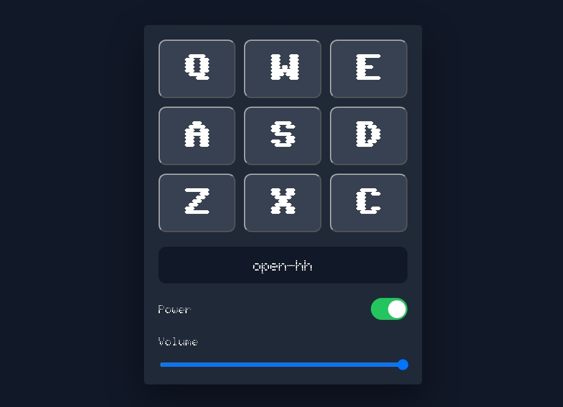

# Build a Drum Machine

<p align="center">
  
  
  
  
</p>

> **Milestone:** Certification Project setelah mempelajari Audio and Video Events.

## About

Project ini merupakan Certification Project dari freeCodeCamp JavaScript Certification yang membangun sebuah drum machine berbasis browser.

Drum pad dapat dimainkan melalui klik mouse maupun tombol keyboard. Project ini juga memiliki power switch, kontrol volume, display untuk menampilkan drum pad yang dimainkan, serta efek visual ketika drum pad ditekan melalui keyboard.

## Preview



## Konsep Utama

- DOM Selection untuk mengambil elemen drum pad, display, power switch, dan volume control.
- Event Listener untuk menangani klik mouse, input volume, perubahan power, dan keyboard.
- HTML `<audio>` untuk menyimpan audio clip pada setiap drum pad.
- `currentTime` untuk mengatur audio kembali ke awal sebelum dimainkan.
- `play()` untuk menjalankan audio clip.
- `volume` untuk mengatur tingkat volume audio.
- Keyboard Event untuk memainkan drum pad menggunakan tombol `Q`, `W`, `E`, `A`, `S`, `D`, `Z`, `X`, dan `C`.
- CSS Grid untuk menyusun drum pad.
- CSS class untuk memberikan efek visual pada drum pad yang dimainkan.

## Struktur Project

```text
drum-machine/
├── index.html
├── styles.css
└── script.js
```

## Source Code

- [`index.html`](./index.html)
- [`styles.css`](./styles.css)
- [`script.js`](./script.js)

## Pembahasan

### 1. Struktur Drum Pad dan Audio

Setiap drum pad dibuat menggunakan elemen `<button>` dengan class `drum-pad` dan berisi elemen `<audio>` sebagai sumber suara.

Setiap audio memiliki `id` yang sama dengan tombol keyboard yang digunakan untuk memainkannya, seperti `Q`, `W`, `E`, dan seterusnya.

```html
<button class="drum-pad" id="heater-1" type="button">
  Q
  <audio
    class="clip"
    id="Q"
    src="https://cdn.freecodecamp.org/curriculum/drum/Heater-1.mp3">
  </audio>
</button>
```

Struktur tersebut membuat satu drum pad memiliki dua bagian utama: tombol yang menerima interaksi pengguna dan audio clip yang akan dimainkan.

### 2. Mengambil Elemen dari DOM

JavaScript mengambil elemen yang diperlukan menggunakan `querySelectorAll()` dan `getElementById()`.

```js
const drumPadElements = document.querySelectorAll(".drum-pad");
const displayElement = document.getElementById("display");
const powerButton = document.getElementById("power");
const volumeElement = document.getElementById("volume");
```

`drumPadElements` berisi seluruh drum pad, sedangkan elemen lainnya digunakan untuk mengontrol display, power, dan volume.

### 3. Memainkan Drum Pad melalui Klik

Setiap drum pad diberikan event listener `click`.

```js
drumPadElements.forEach((drumPad) => {
  drumPad.addEventListener("click", () => {
    if (!isPowerOn) return;

    const audio = drumPad.querySelector(".clip");
    audio.currentTime = 0;
    audio.play();
    audio.volume = volumeLevel;
    displayElement.textContent = drumPad.id;
  })
})
```

Ketika drum pad diklik, kode terlebih dahulu memeriksa status power.

Jika power aktif, elemen `<audio>` di dalam drum pad dicari menggunakan `querySelector(".clip")`. `currentTime` kemudian diatur menjadi `0` agar suara dimulai kembali dari awal sebelum `play()` menjalankan audio.

Display juga diperbarui menggunakan `textContent` untuk menunjukkan `id` drum pad yang dimainkan.

### 4. Memainkan Drum Pad melalui Keyboard

Project juga menerima input dari keyboard melalui event `keydown`.

```js
document.addEventListener("keydown", (event) => {
  if (!isPowerOn) return;

  const key = event.key.toUpperCase();
  const keyElement = document.getElementById(key);

  if (keyElement) {
    keyElement.currentTime = 0;
    keyElement.play();
    keyElement.volume = volumeLevel;
    displayElement.textContent = keyElement.parentElement.id;
  }
})
```

`event.key` digunakan untuk mendapatkan tombol yang ditekan.

`toUpperCase()` memastikan input seperti `q` tetap dapat dicocokkan dengan elemen audio yang menggunakan `id="Q"`.

Setelah elemen audio ditemukan, suara dimainkan dan display diperbarui menggunakan `parentElement.id` untuk mendapatkan `id` drum pad.

### 5. Power, Volume, dan Efek Visual

Power switch mengubah nilai `isPowerOn` berdasarkan status checkbox.

```js
powerButton.addEventListener("change", () => {
  isPowerOn = powerButton.checked;
  displayElement.textContent = isPowerOn ? "On" : "Off";
})
```

Volume control mengubah `volumeLevel` berdasarkan nilai slider.

```js
volumeElement.addEventListener("input", () => {
  displayElement.textContent =
    Number(volumeElement.value) !== 0
      ? `Volume at ${volumeElement.value}`
      : `Volume off`;

  volumeLevel = volumeElement.value / 100;
})
```

Ketika drum pad dimainkan melalui keyboard, class `active` ditambahkan sementara untuk memberikan efek visual.

```js
keyElement.parentElement.classList.add("active");

setTimeout(() => {
  keyElement.parentElement.classList.remove("active");
}, 150);
```

CSS kemudian menggunakan class tersebut untuk memberikan perubahan warna dan efek `scale` pada drum pad.

## Method yang Dipakai

- `querySelectorAll()` digunakan untuk mengambil seluruh elemen drum pad.
- `getElementById()` digunakan untuk mengambil elemen berdasarkan `id`.
- `querySelector()` digunakan untuk mencari audio clip di dalam drum pad.
- `forEach()` digunakan untuk memasang event listener pada setiap drum pad.
- `addEventListener()` digunakan untuk menangani berbagai event pengguna.
- `play()` digunakan untuk memainkan audio clip.
- `toUpperCase()` digunakan untuk mengubah input keyboard menjadi huruf kapital.
- `classList.add()` digunakan untuk menambahkan class efek pada drum pad.
- `classList.remove()` digunakan untuk menghapus class efek dari drum pad.
- `setTimeout()` digunakan untuk menghapus efek visual setelah jeda singkat.

## Eksperimen Tambahan

Saya membuat desain UI sendiri untuk drum machine ini.

Eksperimen yang saya tambahkan meliputi penggunaan font dari Google Fonts, power switch, volume control, serta efek `active` pada drum pad ketika dimainkan melalui keyboard.

## Ringkasan Cepat

| Konsep | Fungsi |
|---|---|
| `<audio>` | Menyimpan audio clip yang digunakan drum pad |
| `currentTime` | Mengatur posisi audio kembali ke awal |
| `play()` | Memainkan audio clip |
| `volume` | Mengatur tingkat volume audio |
| `addEventListener()` | Menangani interaksi pengguna |
| `keydown` | Mendeteksi tombol keyboard yang ditekan |
| `classList` | Mengatur class CSS pada drum pad |
| `setTimeout()` | Memberikan jeda sebelum efek visual dihapus |

## Catatan Belajar

- **DOM Selection** digunakan untuk mengambil elemen HTML yang akan dikendalikan JavaScript.
- **Event Listener** memungkinkan program merespons klik, keyboard, perubahan power, dan perubahan volume.
- **`<audio>`** menyediakan audio clip yang dapat dikontrol melalui JavaScript.
- **`currentTime = 0`** membuat suara dapat dimainkan kembali dari awal.
- **Keyboard Event** memungkinkan satu fungsi dipicu menggunakan tombol keyboard.
- **Class CSS** dapat ditambahkan dan dihapus menggunakan JavaScript untuk memberikan efek visual.

## What I Practiced

```text
DOM Selection
querySelectorAll()
getElementById()
querySelector()
Event Listeners
Click Events
Keyboard Events
Audio Playback
currentTime
Audio Volume
classList
setTimeout()
CSS Grid
Google Fonts
```

---

**Platform:** freeCodeCamp  
**Certification Project:** Build a Drum Machine  
**Language:** JavaScript

---

<p align="center">
  <strong>Certification Project — Build a Drum Machine Completed</strong><br>
  <sub>Next stop: continue the JavaScript Certification journey.</sub>
</p>
