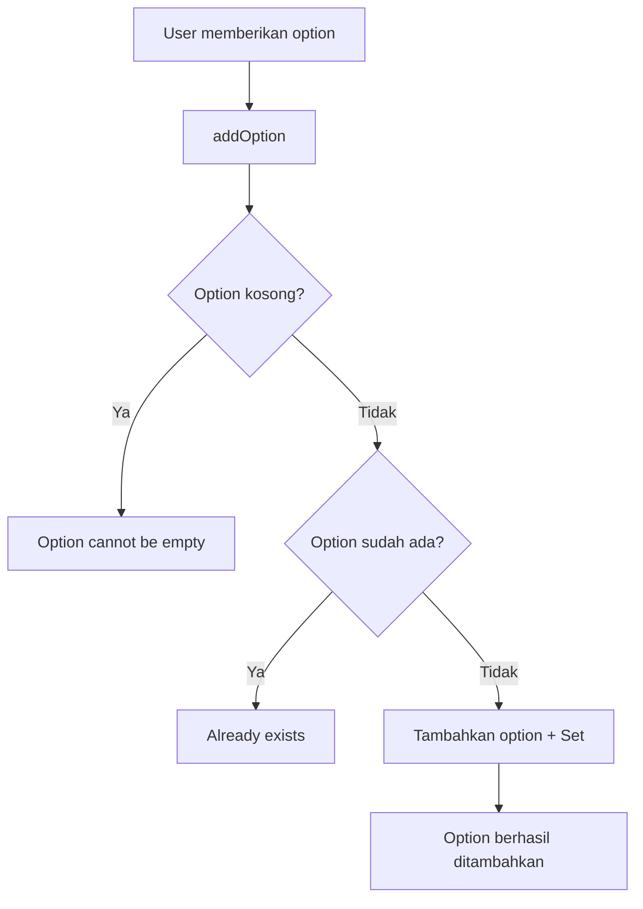
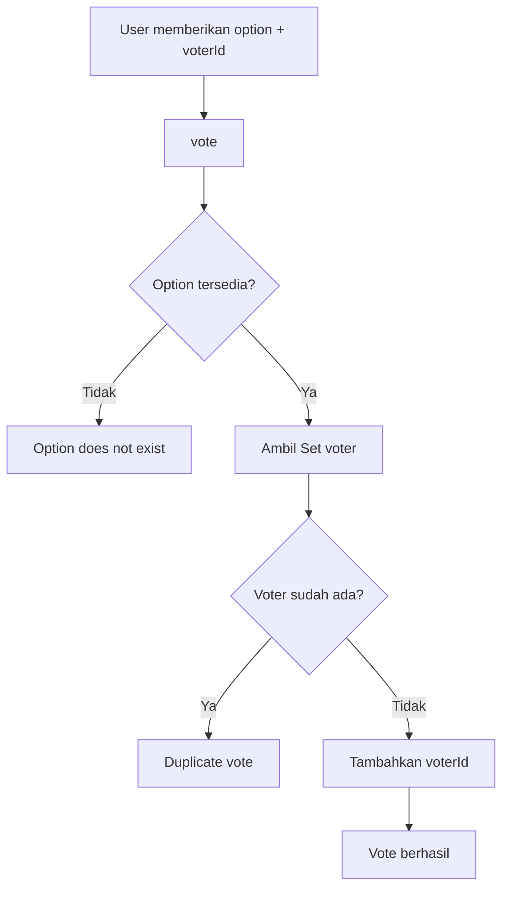
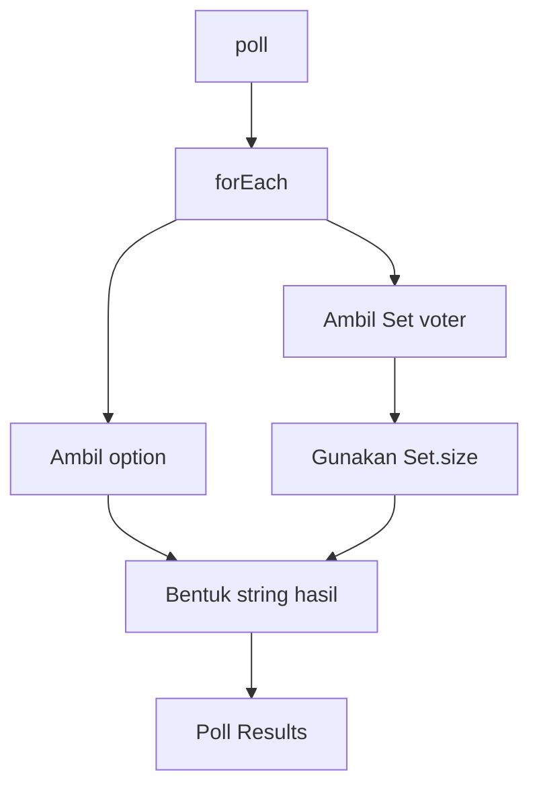
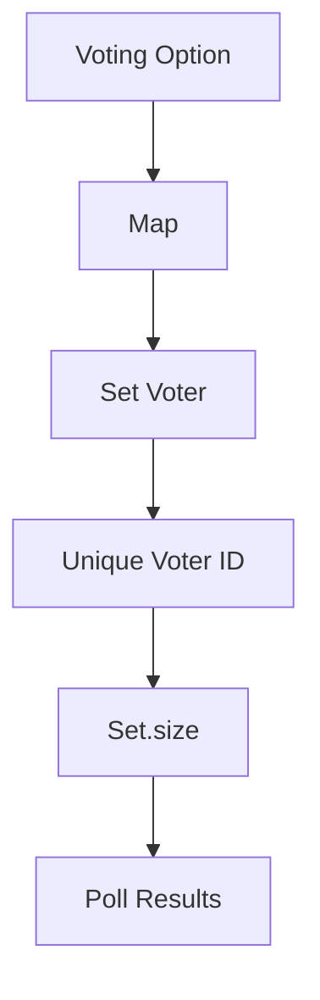

# Build a Voting System

<p align="center">
  Voting system sederhana berbasis <strong>JavaScript</strong> yang menggunakan <strong>Map</strong> untuk menyimpan voting option dan <strong>Set</strong> untuk mencegah duplicate voting.
</p>

<p align="center">
  <strong>JavaScript</strong> ·
  <strong>Map</strong> ·
  <strong>Set</strong> ·
  <strong>Functions</strong> ·
  <strong>Arrow Functions</strong> ·
  <strong>Template Literals</strong>
</p>

---

## Tentang Project

Project ini merupakan latihan **freeCodeCamp Build a Voting System**.

Tujuan utamanya adalah membuat sistem voting sederhana menggunakan `Map` dan `Set`.

`Map` digunakan untuk menyimpan setiap voting option beserta kumpulan voter yang memilih option tersebut.

`Set` digunakan untuk menyimpan voter secara unik sehingga voter yang sama tidak dapat melakukan voting dua kali untuk option yang sama.

Project ini membantu saya memahami hubungan antara **key-value, Map, Set, parameter function, method, dan data collection** di JavaScript.

---

## Fitur

- Menyimpan voting option menggunakan `Map`.
- Menyimpan voter untuk setiap option menggunakan `Set`.
- Menambahkan voting option baru.
- Mencegah option yang sama ditambahkan dua kali.
- Menolak option kosong.
- Memproses vote berdasarkan option dan voter ID.
- Mencegah voter melakukan duplicate vote pada option yang sama.
- Memungkinkan satu option menerima beberapa voter.
- Menampilkan jumlah vote berdasarkan ukuran `Set`.
- Menampilkan hasil voting dalam format yang telah ditentukan.

---

## Struktur Data

Struktur utama project menggunakan `Map` yang berisi `Set`.

```text
poll
├── Indonesia → Set
│              ├── voters1
│              ├── voters2
│              └── voters3
│
├── Malaysia  → Set
│              ├── voters1
│              ├── voters2
│              └── voters3
│
└── Brunei    → Set
               ├── voters1
               ├── voters2
               └── voters3
```

`Map` menyimpan nama negara sebagai **key**.

`Set` menjadi **value** yang menyimpan voter untuk setiap negara.

---

## Struktur Project

```text
build-a-voting-system/
└── script.js
```

---

# JavaScript

## Membuat Map

Voting system dimulai dengan membuat sebuah `Map`.

```js
const poll = new Map();
```

`poll` digunakan sebagai tempat utama untuk menyimpan seluruh voting option.

Setiap option nantinya memiliki sebuah `Set` sebagai value.

---

## Menambahkan Voting Option

Tiga voting option awal ditambahkan menggunakan `set()`.

```js
poll.set("Indonesia", new Set());
poll.set("Malaysia", new Set());
poll.set("Brunei", new Set());
```

Method `set()` digunakan untuk menyimpan pasangan **key-value** pada `Map`.

Dalam project ini:

```text
Key   = nama negara
Value = Set voter
```

Contohnya:

```text
Indonesia → Set
Malaysia  → Set
Brunei    → Set
```

---

## Menambahkan Voter ke Set

Voter ditambahkan ke `Set` milik option tertentu.

```js
poll.get("Indonesia").add("voters1");
poll.get("Indonesia").add("voters2");
poll.get("Indonesia").add("voters3");
```

`get()` digunakan untuk mengambil value berdasarkan key.

Karena value dari `Indonesia` adalah sebuah `Set`, method `add()` kemudian dapat digunakan untuk memasukkan voter.

Alurnya:

```text
poll
↓
get("Indonesia")
↓
Set milik Indonesia
↓
add("voters1")
```

---

## Menambahkan Option dengan `addOption()`

Function `addOption()` menerima satu parameter:

```js
const addOption = (option) => {
  ...
}
```

Parameter `option` digunakan untuk menerima nama voting option yang ingin ditambahkan.

---

### Mengecek Option Kosong

Option kosong diperiksa terlebih dahulu.

```js
if (option === "") return `Option cannot be empty.`;
```

Jika parameter `option` berupa string kosong, function langsung mengembalikan pesan:

```text
Option cannot be empty.
```

---

### Mengecek Option yang Sudah Ada

Keberadaan option diperiksa menggunakan:

```js
poll.has(option)
```

Jika option belum ada:

```js
if (!poll.has(option)) {
  poll.set(option, new Set());
  return `Option "${option}" added to the poll.`;
}
```

Option baru disimpan sebagai key.

Value-nya berupa `Set` kosong.

---

### Mencegah Duplicate Option

Jika option sudah ada:

```js
return `Option "${option}" already exists.`;
```

Dengan begitu option yang sama tidak ditambahkan kembali ke `Map`.

---

## Function `vote()`

Function `vote()` menerima dua parameter:

```js
const vote = (option, voterId) => {
  ...
}
```

Parameter yang digunakan:

```text
option
voterId
```

Ketika function dipanggil:

```js
vote("Malaysia", "traveler1");
```

JavaScript membaca parameter berdasarkan urutan:

```text
option  → "Malaysia"
voterId → "traveler1"
```

---

## Mengecek Voting Option

Sebelum vote diproses, keberadaan option diperiksa:

```js
if (!poll.has(option)) {
  return `Option "${option}" does not exist.`;
}
```

Jika option tidak ditemukan dalam `Map`, proses voting dihentikan.

---

## Mengambil Set Voter

Jika option ditemukan, `Set` milik option tersebut diambil:

```js
const thisOption = poll.get(option);
```

Contohnya:

```js
poll.get("Malaysia");
```

menghasilkan `Set` yang berisi voter untuk Malaysia.

---

## Mengecek Duplicate Vote

Voter diperiksa menggunakan method `has()`:

```js
if (thisOption.has(voterId)) {
  return `Voter ${voterId} has already voted for "${option}".`;
}
```

Jika voter sudah terdapat di dalam `Set`, vote tidak ditambahkan.

Contohnya:

```text
Malaysia
↓
Set
├── traveler1
├── traveler2
└── traveler3
```

Jika `traveler1` mencoba vote Malaysia lagi, `has()` akan menemukan voter tersebut.

---

## Menambahkan Vote

Jika voter belum terdapat di dalam `Set`, voter ditambahkan menggunakan `add()`.

```js
thisOption.add(voterId);
```

Kemudian function mengembalikan:

```js
return `Voter ${voterId} voted for "${option}".`;
```

---

## Kenapa Menggunakan `Set`?

`Set` menyimpan nilai yang unik.

Contohnya:

```js
const voters = new Set();

voters.add("traveler1");
voters.add("traveler2");
voters.add("traveler1");
```

Walaupun `traveler1` ditambahkan dua kali, nilai tersebut hanya disimpan satu kali.

```text
Set
├── traveler1
└── traveler2
```

Hal tersebut sesuai dengan kebutuhan voting system untuk mencegah duplicate vote.

---

## Satu Option Dapat Memiliki Banyak Vote

Satu option tetap dapat menerima beberapa voter yang berbeda.

Contohnya:

```text
Malaysia
↓
Set
├── traveler1
├── traveler2
└── traveler3
```

Setiap voter memiliki ID yang berbeda.

Karena itu `Set` dapat digunakan untuk menyimpan banyak voter pada satu option.

---

# Display Results

## Function `displayResults()`

Hasil voting ditampilkan melalui function:

```js
const displayResults = () => {
  ...
}
```

Function ini tidak menerima parameter.

Data voting diambil langsung dari `poll`.

---

## Iterasi Map dengan `forEach()`

Setiap option diproses menggunakan:

```js
poll.forEach((voters, country) => {
  ...
});
```

Pada `Map`, callback menerima:

```text
value → key
```

Dalam project ini:

```text
voters  → Set milik option
country → nama option
```

Contohnya:

```text
country = "Indonesia"
voters  = Set
```

---

## Menghitung Jumlah Vote

Jumlah voter dihitung menggunakan:

```js
voters.size
```

Karena `voters` merupakan `Set`, property `size` menunjukkan jumlah voter yang tersimpan.

Contohnya:

```text
Indonesia
↓
Set
├── voters1
├── voters2
└── voters3

size = 3
```

---

## Membentuk Hasil Voting

Hasil setiap option disimpan ke dalam variable:

```js
let result = "";
```

Kemudian ditambahkan menggunakan template literal:

```js
result += `${country}: ${voters.size} votes\n`;
```

Contohnya:

```text
Indonesia: 3 votes
Malaysia: 3 votes
Brunei: 3 votes
```

---

## Mengembalikan Hasil

Judul hasil voting ditambahkan sebelum daftar option:

```js
return ("Poll Results:\n" + result).trimEnd();
```

`trimEnd()` digunakan untuk menghilangkan newline tambahan pada bagian akhir string.

Hasil akhirnya menjadi:

```text
Poll Results:
Indonesia: 3 votes
Malaysia: 3 votes
Brunei: 3 votes
```

---

# Alur Program

## Menambahkan Option



---

## Melakukan Vote



---

## Menampilkan Hasil



---

# Konsep JavaScript yang Dilatih

| Konsep | Digunakan untuk |
|---|---|
| `Map` | Menyimpan voting option dan Set voter |
| `Set` | Menyimpan voter secara unik |
| `new Map()` | Membuat Map baru |
| `new Set()` | Membuat Set baru |
| `map.set()` | Menambahkan key-value |
| `map.get()` | Mengambil value berdasarkan key |
| `map.has()` | Mengecek keberadaan key |
| `set.add()` | Menambahkan voter |
| `set.has()` | Mengecek keberadaan voter |
| `set.size` | Menghitung jumlah voter |
| Function | Membuat logic yang dapat dipanggil |
| Parameter | Menerima data dari pemanggilan function |
| Arrow Functions | Menulis function dengan syntax singkat |
| `if` | Mengecek kondisi |
| `return` | Mengembalikan hasil function |
| `forEach()` | Melakukan iterasi terhadap data |
| Template Literals | Membentuk pesan dinamis |
| `trimEnd()` | Menghapus newline di akhir string |

---

# Hal yang Saya Pelajari

## 1. Map Menggunakan Key-Value

`Map` menyimpan data dalam bentuk pasangan:

```text
Key → Value
```

Dalam project ini:

```text
Country → Set
```

Contohnya:

```text
Indonesia → Set
```

Saya belajar bahwa konsep key-value tidak hanya digunakan pada object, tetapi juga dapat digunakan melalui `Map`.

---

## 2. Set Menyimpan Nilai Unik

`Set` digunakan ketika data tidak boleh memiliki duplikat.

Dalam project ini, voter disimpan menggunakan `Set` agar voter yang sama tidak dapat dihitung dua kali pada option yang sama.

---

## 3. Map Dapat Menyimpan Set sebagai Value

Hal yang paling penting dari project ini adalah memahami struktur:

```text
Map
 ↓
Key → Set
```

Setiap option memiliki `Set` sendiri untuk menyimpan voter.

---

## 4. `get()` Mengambil Value

Saya belajar bahwa:

```js
poll.get("Indonesia");
```

berarti mengambil value yang memiliki key:

```text
Indonesia
```

Karena value tersebut berupa `Set`, saya kemudian dapat menggunakan:

```js
poll.get("Indonesia").add("voters1");
```

---

## 5. Parameter Menjadi Input Function

Function:

```js
const vote = (option, voterId) => {
  ...
}
```

memiliki dua parameter.

Saat dipanggil:

```js
vote("Malaysia", "traveler1");
```

nilai tersebut masuk berdasarkan urutan:

```text
option  → Malaysia
voterId → traveler1
```

Saya belajar bahwa parameter merupakan tempat untuk menerima data ketika function dipanggil.

---

## 6. `has()` Digunakan untuk Pengecekan

`has()` digunakan pada dua collection berbeda dalam project ini.

Pada `Map`:

```js
poll.has(option);
```

digunakan untuk mengecek apakah option tersedia.

Pada `Set`:

```js
thisOption.has(voterId);
```

digunakan untuk mengecek apakah voter sudah melakukan vote.

---

## 7. `size` Menghitung Isi Collection

Jumlah vote tidak perlu disimpan dalam variable terpisah.

Jumlah voter dapat diperoleh dari:

```js
voters.size
```

Karena setiap voter disimpan di dalam `Set`, jumlah elemen `Set` menjadi jumlah vote untuk option tersebut.

---

## 8. Map dan Set Memiliki Method yang Berbeda

Saya belajar membedakan:

```text
Map
├── set()
├── get()
├── has()
└── size

Set
├── add()
├── has()
└── size
```

Walaupun keduanya memiliki `has()` dan `size`, fungsi collection-nya berbeda.

`Map` digunakan untuk hubungan **key-value**.

`Set` digunakan untuk kumpulan **nilai unik**.

---

## 9. String Harus Sesuai Requirement

Certification project menggunakan test yang memeriksa hasil string.

Karena itu perbedaan seperti:

```text
exist
exists
```

atau:

```text
"Malaysia"
"Malaysia".
```

dapat membuat test gagal.

Saya belajar bahwa output function harus mengikuti format yang ditentukan oleh requirement.

---

# Alur Data yang Saya Pahami



Struktur data project:

```text
Voting Option
      ↓
     Map
      ↓
     Set
      ↓
  Voter ID
      ↓
   Vote Count
```

---

# Catatan Pengembangan

Pada versi sekarang, data awal voting masih ditambahkan secara langsung menggunakan:

```js
poll.set(...)
poll.get(...).add(...)
```

Function `addOption()` dan `vote()` kemudian digunakan untuk memproses option dan vote tambahan.

Struktur project ini masih sederhana karena tujuan utamanya adalah memahami penggunaan `Map` dan `Set` dalam JavaScript.

Untuk tahap belajar saat ini, saya mempertahankan struktur yang sederhana agar hubungan antara `Map`, `Set`, parameter, method, dan hasil voting tetap mudah dipahami.

---

# Tech Stack

| Technology | Penggunaan |
|---|---|
| JavaScript | Logic voting system |
| Map | Menyimpan voting option dan Set voter |
| Set | Menyimpan voter secara unik |
| Arrow Functions | Mendefinisikan function |
| Template Literals | Membentuk pesan hasil |
| freeCodeCamp | Platform latihan |

---

# Status Project

| Item | Detail |
|---|---|
| Platform | freeCodeCamp |
| Project | Build a Voting System |
| Category | JavaScript |
| Main Concept | Map + Set |
| Input | Voting option + voter ID |
| Duplicate Prevention | Set |
| Output | Poll Results |
| Status | Completed |

---

## Personal Notes

Project ini merupakan latihan pertama saya yang menggabungkan `Map` dan `Set` dalam satu struktur data.

Bagian yang paling membuat saya memahami project ini adalah hubungan:

```text
Map
 ↓
Option
 ↓
Set
 ↓
Voter
```

Sebelumnya saya lebih familiar dengan konsep key-value melalui object.

Melalui project ini saya mulai memahami bahwa `Map` juga dapat digunakan untuk menyimpan pasangan key-value dengan method seperti:

```js
set()
get()
has()
```

Saya juga memahami alasan penggunaan `Set` dalam kasus voting.

Jika `Map` digunakan untuk mengetahui **option apa yang dipilih**, maka `Set` digunakan untuk mengetahui **siapa saja yang sudah memilih option tersebut**.

Struktur tersebut membuat logic duplicate voting menjadi lebih mudah dipahami.

Project ini membantu saya menghubungkan materi **Maps and Sets** dengan penggunaan data collection dalam program JavaScript yang lebih nyata.
