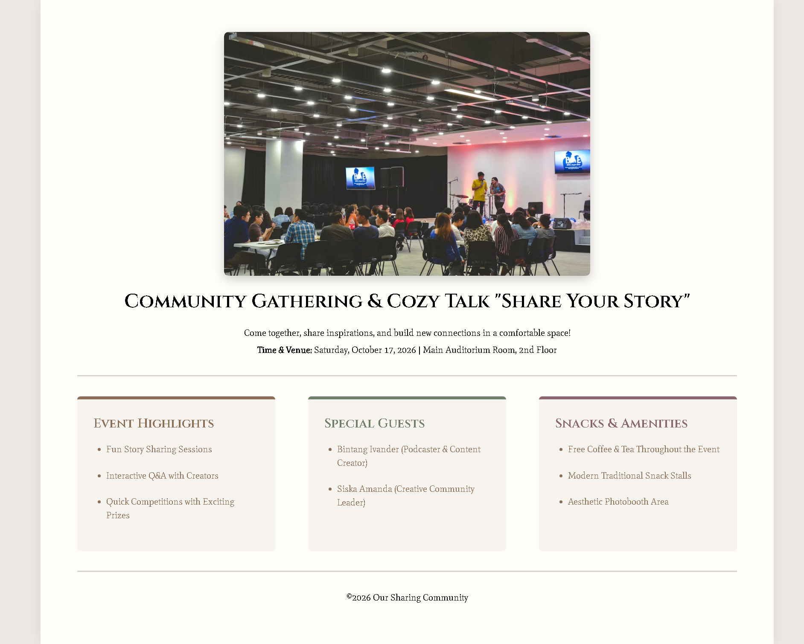

# Event Flyer Page

<p align="center">
  
  
  
</p>

> **Milestone:** Lab pada materi **Absolute and Relative Units** dalam Responsive Web Design Certification freeCodeCamp.

Project ini digunakan untuk memahami bagaimana unit CSS seperti `px`, `%`, `vw`, dan `vh` digunakan untuk menentukan ukuran elemen berdasarkan acuan yang berbeda.

Pada lab ini saya membuat sebuah event flyer untuk:

**Community Gathering & Cozy Talk — "Share Your Story"**

Selain memenuhi user stories dari freeCodeCamp, tampilan project juga dikembangkan dengan layout responsif, custom typography, section cards, dan media query.

---

## Preview

Tambahkan screenshot project di repository dengan nama `preview.png`, kemudian:

```md

```

---

## Konsep Utama

Materi utama yang dipraktikkan dalam lab ini:

```text
Absolute Units
Relative Units
px
%
vw
vh
calc()
width
min-height
padding
margin
```

Beberapa konsep tersebut digunakan bersamaan untuk menentukan ukuran halaman secara relatif terhadap viewport maupun parent element.

---

## Struktur Project

```text
build-an-event-flyer-page/
│
├── index.html
├── styles.css
├── README.md
└── preview.png
```

---

## User Stories Utama

Project harus memiliki struktur halaman berupa:

```text
body
├── header
│   ├── img
│   ├── h1
│   └── p
│
├── hr
│
├── main
│   ├── section
│   ├── section
│   └── section
│
├── hr
│
└── footer
```

Beberapa aturan CSS utama yang diminta oleh lab adalah:

```css
body {
  padding: 50px 0;
  margin: 0 auto;
  width: 90vw;
  min-height: calc(100vh - 100px);
}
```

Selain itu:

```css
hr {
  width: 90%;
}

section {
  width: 30%;
}
```

---

## 1. Absolute Unit dengan `px`

Salah satu unit yang digunakan adalah:

```css
padding: 50px 0;
```

`px` merupakan absolute unit.

Pada bagian tersebut:

```text
padding atas   = 50px
padding kanan  = 0
padding bawah  = 50px
padding kiri   = 0
```

Nilai `50px` tidak dihitung berdasarkan ukuran parent maupun viewport.

---

## 2. Relative Unit dengan `vw`

Body menggunakan:

```css
width: 90vw;
```

`vw` berarti **viewport width**.

Jadi:

```text
1vw = 1% lebar viewport
```

dan:

```text
90vw = 90% lebar viewport
```

Jika viewport berubah ukuran, lebar body ikut berubah.

---

## 3. Relative Unit dengan `vh`

Project menggunakan:

```css
min-height: calc(100vh - 100px);
```

`vh` berarti **viewport height**.

```text
100vh = 100% tinggi viewport
```

Karena body memiliki:

```css
padding-top: 50px;
padding-bottom: 50px;
```

total padding vertikal adalah:

```text
100px
```

Maka:

```css
calc(100vh - 100px)
```

digunakan untuk menentukan tinggi minimum body setelah mempertimbangkan padding atas dan bawah.

---

## 4. Menggunakan `calc()`

CSS menyediakan function:

```css
calc()
```

untuk melakukan perhitungan nilai CSS.

Pada project ini:

```css
min-height: calc(100vh - 100px);
```

menggabungkan dua jenis unit:

```text
vh
px
```

dalam satu perhitungan.

Ini menunjukkan bahwa relative unit dan absolute unit dapat digunakan bersama melalui `calc()`.

---

## 5. Percentage dengan `%`

Elemen `hr` menggunakan:

```css
width: 90%;
```

Sedangkan section menggunakan:

```css
width: 30%;
```

Berbeda dengan `vw`, percentage biasanya dihitung berdasarkan ukuran containing block atau parent yang menjadi acuannya.

Contohnya:

```css
main {
  width: 90%;
}
```

berarti lebar `main` adalah 90% dari ruang yang menjadi acuan layout-nya.

---

## 6. Memahami Perbedaan `%` dan `vw`

Walaupun keduanya relative unit, acuannya berbeda.

| Unit | Acuan |
|---|---|
| `px` | Ukuran tetap |
| `%` | Ukuran containing block / parent |
| `vw` | Lebar viewport |
| `vh` | Tinggi viewport |

Contohnya:

```css
body {
  width: 90vw;
}
```

mengacu pada viewport.

Sedangkan:

```css
main {
  width: 90%;
}
```

mengacu pada ruang yang tersedia dari parent-nya.

---

## 7. Menggunakan `margin: 0 auto`

Body menggunakan:

```css
margin: 0 auto;
```

Nilai pertama berlaku untuk atas dan bawah:

```text
0
```

Sedangkan nilai kedua berlaku untuk kiri dan kanan:

```text
auto
```

Dengan body yang memiliki width tertentu, `auto` pada margin kiri dan kanan membuat body berada di tengah secara horizontal.

Pola serupa juga digunakan pada:

```css
header img {
  margin: 0 auto 20px auto;
}
```

---

## 8. `box-sizing: border-box`

Setiap section menggunakan:

```css
box-sizing: border-box;
```

Section juga memiliki:

```css
width: 30%;
padding: 25px;
```

Dengan:

```css
box-sizing: border-box;
```

padding dihitung sebagai bagian dari width.

Jadi section tetap mempertahankan lebar total sebesar `30%`.

---

## Eksplorasi Tambahan

Beberapa bagian berikut **bukan requirement utama dari user stories**, tetapi saya tambahkan untuk mempraktikkan konsep CSS lain sekaligus memperbaiki tampilan project.

```text
Flexbox
Responsive Design
Media Queries
Google Fonts
box-shadow
border-radius
:nth-of-type()
CSS Cascade
box-sizing
Custom Colors
Responsive Cards
```

---

## 9. Layout dengan Flexbox

Tiga section diletakkan secara horizontal menggunakan:

```css
main {
  display: flex;
  justify-content: space-between;
  width: 90%;
  margin: 0 auto;
}
```

`display: flex` membuat direct children dari `main` menjadi flex items.

Karena direct children tersebut adalah:

```html
<section>...</section>
<section>...</section>
<section>...</section>
```

ketiganya dapat disusun dalam satu baris.

---

## 10. `justify-content: space-between`

Property:

```css
justify-content: space-between;
```

mendistribusikan ruang kosong di antara flex items.

Dengan tiga section:

```text
Section 1     Section 2     Section 3
```

ruang antar-section menjadi lebih teratur.

---

## 11. Membuat Layout Responsive

Pada viewport yang sempit, tiga section tidak cukup nyaman jika terus dipaksa berada pada satu baris.

Karena itu digunakan media query:

```css
@media (max-width: 650px) {
  main {
    flex-direction: column;
    gap: 25px;
  }

  section {
    width: 100%;
  }
}
```

Ketika viewport memiliki lebar maksimal `650px`, layout berubah dari:

```text
[ Section 1 ] [ Section 2 ] [ Section 3 ]
```

menjadi:

```text
[ Section 1 ]

[ Section 2 ]

[ Section 3 ]
```

Nilai `650px` menjadi breakpoint untuk perubahan layout tersebut.

---

## 12. `flex-direction: column`

Pada keadaan normal, flex container menggunakan arah baris.

Media query mengubahnya menjadi:

```css
flex-direction: column;
```

Sehingga section disusun secara vertikal.

---

## 13. `gap`

Saat section berubah menjadi satu kolom, digunakan:

```css
gap: 25px;
```

untuk memberikan jarak antar-flex item tanpa perlu membuat margin khusus pada setiap section.

---

## 14. Menggunakan `:nth-of-type()`

Setiap section memiliki warna aksen yang berbeda.

Contohnya:

```css
section:nth-of-type(2) {
  border-top-color: #6f7f6a;
}

section:nth-of-type(3) {
  border-top-color: #8a6670;
}
```

Selector:

```css
:nth-of-type()
```

digunakan untuk memilih elemen berdasarkan urutannya di antara elemen dengan tipe yang sama.

---

## 15. Selector Turunan

Untuk memilih heading dari section tertentu digunakan:

```css
section:nth-of-type(2) h2 {
  color: #6f7f6a;
}
```

Artinya:

> Pilih `h2` yang berada di dalam section kedua.

Dengan cara ini, style tidak diterapkan kepada seluruh `h2`.

---

## 16. Google Fonts

Project menggunakan dua font:

```css
@import url('https://fonts.googleapis.com/css2?family=Cinzel:wght@400..900&family=Mate:ital@0;1&display=swap');
```

`Cinzel` digunakan untuk heading.

```css
h1,
h2 {
  font-family: "Cinzel", serif;
}
```

Sedangkan `Mate` digunakan untuk body text:

```css
p,
li {
  font-family: "Mate", serif;
}
```

---

## 17. `max-width`

Gambar header menggunakan:

```css
width: 50%;
max-width: 600px;
```

`width: 50%` membuat ukuran gambar mengikuti ruang parent.

Sedangkan:

```css
max-width: 600px;
```

membatasi agar gambar tidak terus membesar pada viewport yang lebar.

---

## 18. `border-radius`

Gambar dan section menggunakan:

```css
border-radius
```

untuk memberikan sudut yang sedikit membulat.

Contohnya:

```css
header img {
  border-radius: 7px;
}
```

dan:

```css
section {
  border-radius: 5px;
}
```

---

## 19. `box-shadow`

Gambar menggunakan:

```css
box-shadow: 0 5px 17px rgba(0, 0, 0, 0.2);
```

Sedangkan body menggunakan:

```css
box-shadow: 0 0 21px rgba(0, 0, 0, 0.08);
```

`box-shadow` dapat menggunakan beberapa nilai untuk menentukan posisi dan blur bayangan.

Struktur sederhananya:

```text
horizontal-offset
vertical-offset
blur-radius
color
```

---

## Bagian yang Paling Penting Buat Saya

### Relative Unit Tidak Selalu Memiliki Acuan yang Sama

```css
width: 90vw;
```

menggunakan viewport sebagai acuan.

Sedangkan:

```css
width: 90%;
```

menggunakan containing block sebagai acuan.

Jadi walaupun keduanya relative unit, cara perhitungannya berbeda.

---

### `calc()` Bisa Menggabungkan Unit

```css
min-height: calc(100vh - 100px);
```

menunjukkan bahwa CSS dapat melakukan perhitungan antara:

```text
relative unit
+
absolute unit
```

dalam satu expression.

---

### Parent Dapat Mengatur Layout Child

Saat:

```css
main {
  display: flex;
}
```

yang berubah bukan hanya `main`.

Direct children di dalamnya menjadi flex items.

Dalam project ini:

```text
main
├── section
├── section
└── section
```

ketiga section menjadi flex items.

---

### Responsive Design Tidak Berarti Semuanya Harus Mengecil

Ketika ruang sudah terlalu sempit, section tidak terus dipaksa mengecil.

Media query mengubah layout dari tiga kolom menjadi satu kolom.

```css
@media (max-width: 650px)
```

menjadi batas perubahan layout tersebut.

---

## Ringkasan Cepat

| Konsep | Fungsi |
|---|---|
| `px` | Absolute unit |
| `%` | Relative terhadap containing block |
| `vw` | Relative terhadap lebar viewport |
| `vh` | Relative terhadap tinggi viewport |
| `calc()` | Melakukan perhitungan nilai CSS |
| `min-height` | Menentukan tinggi minimum |
| `margin: auto` | Membantu memusatkan elemen dengan width tertentu |
| `box-sizing` | Mengatur bagaimana width dan height dihitung |
| `display: flex` | Membuat flex formatting context |
| `justify-content` | Mengatur distribusi flex items |
| `flex-direction` | Mengatur arah flex items |
| `gap` | Memberikan jarak antar-item |
| `@media` | Memberikan CSS berdasarkan kondisi media |
| `max-width` | Membatasi lebar maksimum |
| `:nth-of-type()` | Memilih elemen berdasarkan urutan tipenya |
| `border-radius` | Membulatkan sudut |
| `box-shadow` | Memberikan bayangan |

---

## Catatan Belajar

- **`px`** merupakan absolute unit.
- **`vw`** menggunakan lebar viewport sebagai acuan.
- **`vh`** menggunakan tinggi viewport sebagai acuan.
- **Percentage** menggunakan containing block sebagai acuan.
- **`calc()`** dapat melakukan operasi antara unit CSS yang berbeda.
- **`margin: 0 auto`** dapat digunakan untuk memusatkan elemen yang mempunyai width.
- **`box-sizing: border-box`** memasukkan padding dan border ke dalam perhitungan width.
- **Flexbox** dapat digunakan untuk mengatur beberapa section dalam satu baris.
- **Media query** dapat mengubah layout berdasarkan ukuran viewport.
- **Breakpoint** adalah titik ketika aturan responsive tertentu mulai digunakan.
- **`:nth-of-type()`** dapat memilih elemen berdasarkan urutannya.
- **`max-width`** menjaga elemen agar tidak menjadi terlalu besar.
- User stories menentukan requirement minimum, sedangkan CSS tambahan dapat digunakan untuk eksplorasi desain selama requirement tersebut tetap terpenuhi.

---

## What I Practiced

```text
HTML Structure
Semantic HTML
CSS Absolute Units
CSS Relative Units
px
%
vw
vh
calc()
Width and Min Height
Margin
Padding
box-sizing
Flexbox
Responsive Layout
Media Queries
Breakpoints
flex-direction
justify-content
gap
:nth-of-type()
Descendant Selectors
Google Fonts
max-width
border-radius
box-shadow
CSS Cascade
```

---

<p align="center">
  <strong>Absolute and Relative Units — Event Flyer Page Completed</strong><br>
  <sub>Next stop: continue the Responsive Web Design Certification journey.</sub>
</p>

---

**Platform:** freeCodeCamp  
**Lab:** Build an Event Flyer Page  
**Languages:** HTML & CSS  
**Focus:** Absolute and Relative Units
