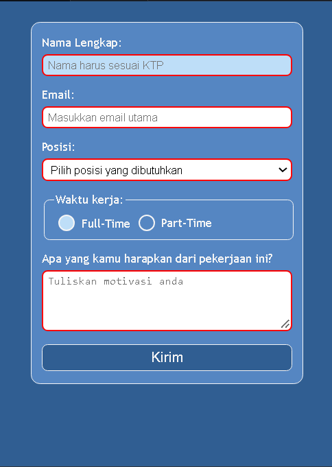

# Build a Job Application Form

<p align="center">
  
  
  
</p>

> **Milestone:** Lab setelah mempelajari Pseudo Classes and Elements.

## About

Project ini membuat sebuah form lamaran pekerjaan menggunakan HTML dan CSS. Form menerima nama lengkap, email, posisi pekerjaan, pilihan waktu kerja, serta pesan dari pengguna.

Fokus utama lab adalah mempraktikkan pseudo-class CSS seperti `:focus`, `:valid`, `:invalid`, `:hover`, `:checked`, dan `:first-of-type`, serta menggunakan pseudo-element `::before` pada custom radio button.

## Preview



## Konsep Utama

- HTML Form
- Form Labels
- Form Validation
- `required`
- `:focus`
- `:valid`
- `:invalid`
- `:hover`
- `:active`
- `:checked`
- `:first-of-type`
- `::before`
- Attribute Selector
- Adjacent Sibling Combinator

## Struktur Project

```text
job-application-form/
├── index.html
├── styles.css
└── preview.png
```

## Source Code

- [`index.html`](./index.html)
- [`styles.css`](./styles.css)

## Pembahasan

### 1. Struktur Form dan Association dengan `label`

Form berada di dalam elemen `.container` dan menggunakan beberapa jenis form control:

```html
<input type="text" id="name" required />
<input type="email" id="email" required />
<select id="position" required>
<textarea id="message" required></textarea>
```

Setiap input utama, `select`, dan `textarea` memiliki `label` yang terhubung melalui pasangan attribute `for` dan `id`.

Contohnya:

```html
<label for="email">Email:</label>
<input type="email" id="email" required />
```

Nilai `for="email"` pada `label` mengacu pada `id="email"` milik input.

### 2. Validasi Dasar dengan HTML

Field nama, email, posisi, pilihan waktu kerja, dan pesan menggunakan `required` agar browser dapat mengecek apakah input wajib sudah diisi.

Input email juga menggunakan:

```html
type="email"
```

Browser dapat menggunakan tipe tersebut untuk memeriksa apakah nilai yang dimasukkan sesuai dengan format email dasar.

### 3. State `:focus`

Input dan textarea memiliki style khusus ketika sedang menerima focus:

```css
input:focus,
textarea:focus {
  border-color: #7cdeff;
  outline: none;
}
```

`:focus` aktif ketika elemen sedang dipilih untuk menerima input, misalnya setelah pengguna mengklik field atau berpindah ke field tersebut menggunakan keyboard.

`outline: none` menghapus outline bawaan browser, sedangkan perubahan `border-color` tetap memberikan tanda visual bahwa field sedang aktif.

### 4. State `:valid` dan `:invalid`

Form control menggunakan pseudo-class validasi:

```css
input:valid,
select:valid,
textarea:valid {
  border-color: green;
}

input:invalid,
select:invalid,
textarea:invalid {
  border-color: red;
}
```

`:valid` cocok ketika nilai elemen memenuhi aturan validasi HTML yang berlaku.

`:invalid` cocok ketika nilai elemen belum memenuhi aturan tersebut, misalnya field `required` masih kosong atau nilai input email tidak sesuai dengan format yang diterima browser.

### 5. State `:hover` dan `:active` pada Button

Button submit menggunakan:

```css
button:hover {
  background-color: #407bc0;
}

button:active {
  background-color: #40c042;
}
```

`:hover` aktif ketika pointer berada di atas button.

`:active` aktif ketika button sedang ditekan.

Kedua pseudo-class tersebut memberikan feedback visual terhadap interaksi pengguna.

### 6. Custom Radio Button dengan Attribute Selector

Radio button ditargetkan menggunakan:

```css
.radio-group input[type="radio"]
```

`[type="radio"]` merupakan attribute selector yang memilih elemen `input` dengan attribute `type` bernilai `radio`.

Property:

```css
appearance: none;
```

menghilangkan tampilan radio button bawaan browser sehingga bentuknya dapat dibuat ulang menggunakan CSS.

### 7. Pseudo-element `::before`

Bagian dalam custom radio dibuat menggunakan:

```css
.radio-group input[type="radio"]::before
```

Pseudo-element `::before` menghasilkan bagian visual tambahan sebelum content elemen tanpa menambahkan elemen baru ke HTML.

Pada keadaan awal, bagian tersebut menggunakan:

```css
transform: translate(-3px, -1px) scale(0);
```

Nilai `scale(0)` membuat lingkaran bagian dalam tidak terlihat.

Ketika radio dipilih, rule berikut digunakan:

```css
.radio-group input[type="radio"]:checked::before {
  transform: translate(-3px, -1px) scale(1);
  background-color: rgb(0, 255, 110);
}
```

`scale(1)` membuat bagian dalam kembali terlihat.

### 8. State `:checked`

Radio button yang sedang dipilih ditargetkan dengan:

```css
.radio-group input[type="radio"]:checked {
  border-color: #00ff6e;
  background-color: #ffffff;
  box-shadow: 0 0 7px rgba(0, 255, 110, 0.06);
}
```

`:checked` berlaku ketika radio button berada dalam keadaan terpilih.

State tersebut digunakan untuk mengubah border, background, dan box shadow radio button.

### 9. Mengubah Label dengan Adjacent Sibling Combinator

Project menggunakan:

```css
.radio-group input[type="radio"]:checked + label {
  color: #00ff6e;
}
```

Simbol `+` adalah adjacent sibling combinator.

Selector tersebut memilih `label` yang berada tepat setelah radio button yang sedang `:checked`, sehingga warna teks label mengikuti state radio yang dipilih.

### 10. Selector `:first-of-type`

Project menggunakan:

```css
input:first-of-type {
  background-color: #bedef8;
}
```

`:first-of-type` memilih elemen `input` pertama di antara sibling dengan tipe elemen yang sama di dalam parent-nya.

Pada bagian utama form, input nama merupakan elemen `input` pertama sehingga mendapatkan background yang berbeda.

Karena `:first-of-type` dievaluasi berdasarkan masing-masing parent, selector ini juga dapat cocok dengan input pertama di parent lain, seperti radio pertama di dalam `fieldset`.

### 11. Layout Form

Direct children dari form diatur menggunakan:

```css
.container form > * {
  width: 100%;
  display: block;
  box-sizing: border-box;
}
```

Child combinator `>` membatasi selector pada elemen yang menjadi direct child dari `form`.

`box-sizing: border-box` membuat padding dan border ikut dihitung di dalam total width elemen.

## Ringkasan Cepat

| Konsep | Fungsi |
|---|---|
| `required` | Menandai form control sebagai input wajib |
| `:focus` | Memilih elemen yang sedang menerima focus |
| `:valid` | Memilih form control yang memenuhi aturan validasi |
| `:invalid` | Memilih form control yang belum memenuhi aturan validasi |
| `:hover` | Memilih elemen saat pointer berada di atasnya |
| `:active` | Memilih elemen saat sedang diaktifkan atau ditekan |
| `:checked` | Memilih radio atau checkbox yang sedang terpilih |
| `:first-of-type` | Memilih elemen pertama berdasarkan tipenya di dalam parent |
| `::before` | Membuat pseudo-element sebelum content elemen |
| `[type="radio"]` | Memilih elemen berdasarkan attribute dan nilainya |
| `+` | Memilih sibling yang tepat berada setelah elemen sebelumnya |
| `>` | Memilih direct child dari sebuah elemen |
| `appearance: none` | Menghilangkan tampilan bawaan browser pada control tertentu |
| `box-sizing: border-box` | Memasukkan padding dan border ke dalam perhitungan ukuran elemen |

## Catatan Belajar

- **`:focus`** digunakan untuk memberi feedback visual pada field yang sedang aktif.
- **`:valid` dan `:invalid`** bekerja bersama aturan validasi yang berasal dari HTML.
- **`:checked`** dapat digunakan untuk menata radio button berdasarkan state pilihannya.
- **Adjacent sibling combinator `+`** dapat menargetkan label yang berada tepat setelah radio button.
- **`::before`** dapat membuat bagian visual tambahan tanpa menambahkan elemen baru ke HTML.
- **`:first-of-type`** bekerja berdasarkan tipe elemen di dalam masing-masing parent, bukan berdasarkan seluruh halaman.
- **Attribute selector** seperti `[type="radio"]` memungkinkan CSS menargetkan input dengan tipe tertentu.
- **Urutan rule CSS** tetap berpengaruh ketika beberapa pseudo-class dengan specificity yang sama aktif pada elemen yang sama.

## What I Practiced

```text
HTML Forms
Form Labels
HTML Validation
CSS Pseudo-classes
CSS Pseudo-elements
:focus
:valid
:invalid
:hover
:active
:checked
:first-of-type
Attribute Selectors
Sibling Combinators
Custom Radio Buttons
```

---

**Platform:** freeCodeCamp  
**Lab:** Build a Job Application Form  
**Languages:** HTML & CSS  
**Focus:** Pseudo Classes and Elements

---

<p align="center">
  <strong>Pseudo Classes and Elements Section — Build a Job Application Form Completed</strong><br>
  <sub>Next stop: continue the Responsive Web Design Certification journey.</sub>
</p>
